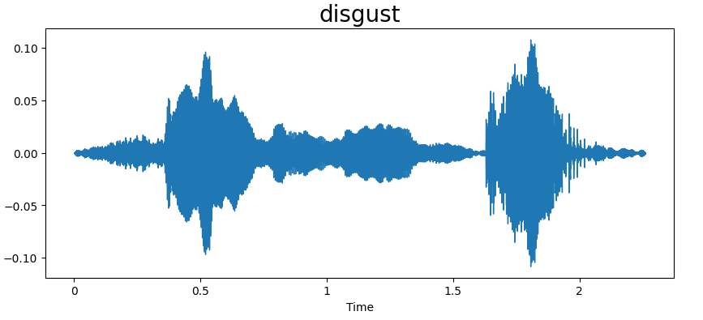

# Speech Emotion Recognition Project

### Author: Virendrasinh Chavda

This repository contains a machine learning-based project for recognizing emotions from speech audio data. The goal is to classify speech into distinct emotional categories using deep learning models. The project is designed to assist in applications like sentiment analysis, virtual assistants, and human-computer interaction.

---

## Table of Contents
1. [Overview](#overview)
2. [Installation](#installation)
3. [Data](#data)
4. [Features](#features)
5. [Visualizations](#visualizations)
6. [Methodology](#methodology)
7. [Results](#results)
8. [Future Work](#future-work)
9. [Contributing](#contributing)
10. [License](#license)

---

## Overview

Understanding human emotions from speech is an important step towards enhancing the capabilities of artificial intelligence in communication-based tasks. This project processes speech data to classify it into predefined emotional categories such as happiness, sadness, anger, and others. Using a deep learning approach, the system learns the features from spectrogram representations of speech and predicts the associated emotion.

The model is trained and evaluated on a labeled speech dataset and provides metrics such as accuracy, loss curves, confusion matrices, and insightful visualizations of waveforms and spectrograms for each emotion.

---

## Installation

To run this project, set up the required Python environment, install the dependencies listed in the `requirements.txt` file, and open the `Speech_emotion_recognition.ipynb` Jupyter Notebook to execute the code.

---

## Data

The dataset used in this project contains labeled speech samples categorized by emotional states. Key features include:

- **Audio Samples**: Speech recordings with varying lengths.
- **Labels**: Emotion classes such as Happy, Sad, Angry, Neutral, etc.

The audio data is preprocessed to extract features like spectrograms or mel-frequency cepstral coefficients (MFCCs) for model training.

---

## Features

### Deep Learning Model
- Utilizes a neural network architecture designed for audio feature learning.
- Employs spectrogram-based input features to capture temporal and frequency patterns.

### Visualizations
- **Waveforms**: Show the time-domain representation of audio signals.
- **Spectrograms**: Represent frequency content over time.
- **Model Loss Curve**: Tracks training and validation loss over epochs.
- **Model Accuracy Curve**: Tracks training and validation accuracy over epochs.
- **Confusion Matrix**: Illustrates classification performance across emotion categories.
- **Classification Report**: Detailed precision, recall, and F1-score metrics for each emotion.

### Interactive Exploration
- Includes a Jupyter Notebook interface for executing the model and analyzing results.

---

## Visualizations

### Waveforms and Spectrograms
The following waveforms and spectrograms represent different emotional states in the dataset. Each visualization provides insight into the distinct patterns of speech associated with each emotion:

#### Fear
- **Waveform**: The waveform shows sudden spikes and intervals of silence, reflecting intense and irregular vocal energy typical of fear.
  
  

- **Spectrogram**: The spectrogram reveals higher energy concentrations in lower frequencies, with gaps indicating breaks in speech caused by fear.

  

#### Angry
- **Waveform**: The waveform exhibits pronounced peaks and high intensity throughout, reflecting the aggressive tone of anger.

  

- **Spectrogram**: The spectrogram shows widespread energy across a range of frequencies, characteristic of a forceful and loud vocal expression.

  

#### Disgust
- **Waveform**: The waveform for disgust shows moderate intensity with irregular oscillations, indicating a drawn-out and hesitant speech pattern.

  

- **Spectrogram**: The spectrogram indicates lower energy with some high-frequency components, reflecting the restrained tone of disgust.

  

#### Happy
- **Waveform**: The waveform for happiness features smooth but pronounced oscillations, indicating energetic and rhythmic speech.

  

- **Spectrogram**: The spectrogram shows energy concentrated in the mid-to-high frequency ranges, consistent with the cheerful tone of happiness.

  

---

## Methodology

1. **Data Preprocessing**:
   - Converted raw audio to spectrograms or MFCC features.
   - Normalized feature values for consistent model training.

2. **Model Architecture**:
   - Designed a deep learning model for emotion classification.
   - Used categorical cross-entropy as the loss function and Adam optimizer for training.

3. **Training and Validation**:
   - Split the dataset into training, validation, and test sets.
   - Monitored performance through metrics such as accuracy and loss.

4. **Performance Evaluation**:
   - Visualized results using loss curves, accuracy curves, confusion matrices, and emotion-specific visualizations.

---

## Results

The model demonstrated excellent performance in recognizing emotions from speech data. Below are the key visualizations:

### Model Loss
The loss curves show steady convergence during training:

### Model Accuracy
The accuracy curves demonstrate high and stable accuracy for both training and validation datasets:

### Confusion Matrix
The confusion matrix highlights the model's classification performance across all emotion classes:

### Classification Report
The detailed classification report below shows precision, recall, F1-score, and support for each emotion class, along with overall metrics such as accuracy:

---

## Future Work

1. **Model Enhancement**:
   - Explore advanced architectures such as CNN-LSTM hybrids or transformers.

2. **Data Augmentation**:
   - Incorporate techniques like pitch shifting, time-stretching, and noise addition to improve robustness.

3. **Deployment**:
   - Develop a web-based or mobile interface for real-time speech emotion recognition.

---

## Contributing

Contributions are welcome! Feel free to fork the repository, make improvements, and submit a pull request. If you encounter any issues, please open a GitHub issue for discussion.

---

## License

This project is licensed under the MIT License. See the [LICENSE](./LICENSE) file for more details.
